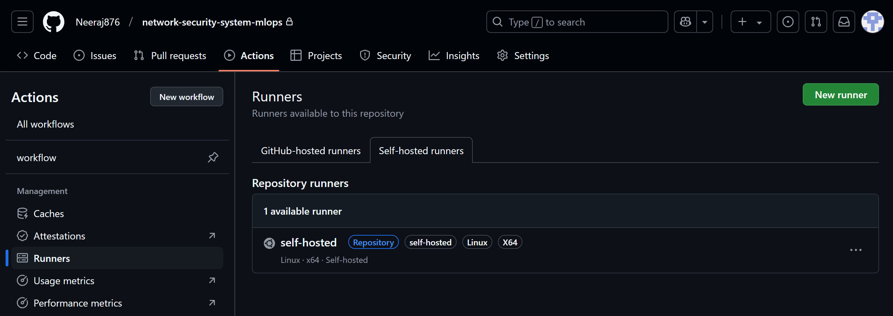

# Network Security - Malicious URL Detection using MLOps

A comprehensive end-to-end MLOps project designed to detect malicious URLs using XGBoost, ensuring user safety by identifying harmful links through machine learning. By combining data ingestion, model training, deployment, and monitoring, it provides a complete solution for real-time and batch URL safety assessments.

## Introduction

Malicious URLs are links that lead to harmful websites, often used by cybercriminals through phishing emails, social engineering, and other tactics. This project detects malicious URLs using machine learning and provides both single URL predictions and batch predictions through an interactive UI.

## Architecture


## Tech Stack 🛠️

| Category         | Tools/Technologies    | Description                                                                 |
|------------------|-----------------------|-----------------------------------------------------------------------------|
| Frontend         | Streamlit             | Provides a simple UI for real-time single URL predictions                   |
| Backend          | FastAPI               | Handles batch predictions and API endpoints                                 |
| Modeling         | RandomForest, Python       | Machine learning model for detecting malicious URLs                         |
| Database         | MongoDB               | Stores data records for ingestion and model training                         |
| Orchestration    | Apache Airflow        | Orchestrates training, retraining, and batch prediction pipelines            |
| Experiment Tracking| MLflow               | Tracks model metrics like F1-score, Precision, and Recall                   |
| CI/CD            | GitHub Actions        | Automates CI/CD pipelines, including Docker build and deployment            |
| Containerization | Docker, AWS ECR       | Docker images stored securely in ECR for consistent deployment              |
| Cloud Storage    | AWS S3                | Stores artifacts, trained models, and logs                                  |
| Cloud Hosting    | AWS EC2 Instance      | Serves as a self-hosted runner for GitHub Actions                           |

# Project Highlights 🌟

## ML Pipeline & Monitoring

- **End-to-End MLOps Pipeline**  
  From data ingestion to deployment, ensuring seamless integration and automated workflows.

- **Real-time Single URL Predictions**  
  Users can instantly interact with the model via a **Streamlit** app for real-time safety assessments on individual URLs.

- **Batch Predictions for Large Datasets**  
  Efficiently process multiple URLs at once using **FastAPI**, designed for bulk predictions and high-throughput scenarios.

- **Automated Model Retraining**  
  Ensure that the model stays up-to-date with new data through an **Apache Airflow** powered retraining pipeline, running at scheduled intervals or triggered manually.

- **Comprehensive Metrics Tracking**  
  All experiments are logged and tracked with **MLflow** in **AWS**, providing a centralized dashboard to compare and monitor model performance and facilitate easy experimentation.

## Infrastructure & Deployment

- **Containerized with Docker**  
  The entire application is containerized using **Docker**, ensuring consistent environments from development to production.

- **Artifact & Model Storage**  
  Models, artifacts, and other intermediate data are securely stored in **AWS S3**, ready for deployment at any stage.

- **Scalable Cloud Deployment on AWS EC2**  
  Deployed on **AWS EC2 instances**, enabling scalable cloud infrastructure for reliable performance under varying loads.

- **Multiple Deployment Options**  
  - **FastAPI** for efficient API endpoints. It includes two routes:  
    - **/train** for training the model with existing data.  
    - **/predict** for making batch predictions (bulk predictions) on input data.
  - **Streamlit** for an interactive web interface, enabling easy user interaction with the model for real-time predictions.

## CI/CD & Version Control

- **Automated CI/CD Pipeline**  
  Streamline testing, validation, and deployment with a fully automated **GitHub Actions** pipeline, integrating with **AWS EC2** and **Amazon ECR**.
  - **Automated Testing & Validation** ensures code quality and reduces errors.
  - **Docker Image Build & Push** to **Amazon ECR**, ensuring that every deployment is consistent and traceable.
  - **Deployment to Production** in **AWS EC2** with automated rollbacks and fail-safes for zero-downtime deployments.

- **Version Control for Code and Data**  
  - **Code Versioning** via **Git** and **GitHub** ensures your codebase is always up-to-date.
  - **Data Versioning** with tools for **schema tracking** and **drift detection**, ensuring high data quality and maintaining model integrity over time.


## Components

### 1. Frontend (Streamlit)
The Streamlit app provides an intuitive interface for users to predict single URLs as Malicious, Suspicious or Safe:


- Safe URL Example:


- Suspicious URL Example:


- Malicious URL Example:


### 2. Backend (FastAPI)
FastAPI handles model operations and batch predictions:

- API Documentation:


- Training Route:


- Training Execution:


- AWS S3 bucket named "networksecurity3" where the artifacts, model.pkl and preprocessor.pkl are stored.


- Batch Prediction Route:


- Batch Prediction Execution:


- AWS S3 bucket named "my-network-datasource-neeraj" where the csv file uploaded by users to `POST /predict` is stored.


### 3. MLOps Pipeline

#### Data Ingestion
- MongoDB integration for data retrieval
- Exported the processed data to a feature store for further usage.
- Split the data into training and testing datasets, ensuring no data leakage.


2. **Data Validation**:
   - Validated the schema to ensure all required columns are present.
   - Checked numerical columns for correctness and detected **data drift** using statistical tests.
   - Generated detailed drift reports to monitor dataset consistency.

3. **Data Transformation**:
   - Applied preprocessing steps, such as imputing missing values using a **KNNImputer**.
   - Prepared the data into transformed **NumPy arrays** for model training.
   - Saved the transformation pipeline as an artifact for future use.
   - Saved the preprocessing pipeline as a **pickle file**.

4. **Model Training and Evaluation**:
   - Implemented a range of classification models, including Random Forest, Gradient Boosting, Decision Tree, Logistic Regression, and AdaBoost.
   - Performed hyperparameter tuning using **GridSearchCV** with predefined parameter grids for each model to enhance performance.
   - Trained and tested models on transformed datasets to ensure consistent preprocessing.
   - Compared the performance of different models using multiple evaluation metrics to ensure the most suitable model was selected for the task.
   - Saved the final trained model as a **pickle file**.
   - Evaluated metrics such as **Precision**, **Recall**, and **F1-score** for the model through multiple experiments, with results tracked using **MLflow**, which is hosted on **AWS**. 
    
    

### 4. AWS Integration

#### S3 Storage
- Centralized artifact and model storage


### 5. CI/CD Pipeline with GitHub Actions

The project leverages a robust **CI/CD pipeline** to automate the integration, delivery, and deployment processes, streamlining the development lifecycle. With **GitHub Actions**, every code update triggers automated workflows to test, build, and deploy the application efficiently and reliably.

- Using AWS EC2 instance as a Self-Hosted Runner for Github Actions
  
  

- Pipeline Stages:
  - Continuous Integration:
    
  - Continuous Delivery:
    
  - Deployment:
    

- Successful Pipeline Execution:


### 6. Docker Integration
- ECR Image Management


### 7. Airflow Integration

- Airflow Login:


- DAGs:
  - Batch Prediction DAG:
    
  - Training Pipeline DAG:
    

- DAG Overview:


- DAG Execution:


## Dataset and Features


The dataset contains 30 features extracted from URLs to classify them as Malicious or Safe.

### Key Features

| Feature Name           | Description                                                            |
|------------------------|------------------------------------------------------------------------|
| `having_IP_Address`     | Checks if URL contains IP address instead of domain name               |
| `URL_Length`            | Measures URL length; longer URLs often hide malicious content          |
| `Shortening_Service`    | Detects use of URL shortening services like `bit.ly`                    |
| `having_At_Symbol`      | Flags presence of '@' in URL                                           |
| `double_slash_redirecting` | Identifies multiple slashes after protocol                            |

<details>
<summary>Click here to view all features</summary>

| Feature Name           | Description                                                            |
|------------------------|------------------------------------------------------------------------|
| `Prefix_Suffix`         | Checks for dashes in domain                                            |
| `having_Sub_Domain`     | Counts number of subdomains                                             |
| `SSLfinal_State`        | Analyzes SSL certificate                                               |
| `Domain_registration_length` | Measures domain registration duration                               |
| `Favicon`               | Checks favicon source                                                  |
| `port`                  | Detects unusual ports                                                  |
| `HTTPS_token`           | Flags 'HTTPS' in domain name                                           |
| `Request_URL`           | Checks resource loading domains                                        |
| `URL_of_Anchor`         | Analyzes anchor tag destinations                                       |
| `Links_in_tags`         | Measures links in HTML tags                                            |
| `SFH`                   | Checks form handler locations                                          |
| `Submitting_to_email`   | Flags form submission to email                                         |
| `Abnormal_URL`          | Identifies URL-domain mismatches                                       |
| `Redirect`              | Counts redirections                                                     |
| `on_mouseover`          | Detects JavaScript events                                              |
| `RightClick`            | Identifies right-click disabling                                        |
| `popUpWindow`           | Flags popup windows                                                    |
| `Iframe`                | Detects invisible iframes                                              |
| `age_of_domain`         | Analyzes domain age                                                    |
| `DNSRecord`             | Checks DNS records                                                     |
| `web_traffic`           | Measures website traffic                                               |
| `Page_Rank`             | Checks page rank                                                        |
| `Google_Index`          | Identifies Google indexing                                              |
| `Links_pointing_to_page`| Counts inbound links                                                    |
| `Statistical_report`    | Flags reported suspicious activity                                     |

</details>

---

## **How to Run the Project** 🚀

This section provides a step-by-step guide on how to set up and run the Malicious URL Detection project both locally and in a deployed environment.

### **Installation**

1. **Clone the Repository:**
   ```bash
   git clone https://github.com/yourusername/malicious-url-detection.git
   cd malicious-url-detection
   ```
2. **Install Dependencies:**
   ```bash
   pip install -r requirements.txt
   ```

### **Local Setup**

1. **Start the Streamlit App:**
   - Launch the user interface for **single URL prediction**.
   ```bash
   streamlit run app.py
   ```
2. **Run the FastAPI Backend:**
   - Start the API for handling **batch predictions**.
   ```bash
   uvicorn main:app --reload
   ```

### **Deployment**

1. **Build and Push Docker Image:**
   - Build the Docker image and push it to **AWS ECR**.
   ```bash
   docker build -t your-docker-image .
   docker tag your-docker-image:latest <AWS_ECR_URI>
   docker push <AWS_ECR_URI>
   ```
2. **Run Docker Container on EC2 Instance:**
   - Start the **AWS EC2** instance and run the container.
   ```bash
   docker run -d -p 80:80 your-docker-image
   ```

### **Running the Project Components**

1. **Data Ingestion:**
   - Start by fetching data from **MongoDB** using the `data_ingestion` module.

2. **Pipeline Execution:**
   - Use **Airflow DAGs** (`network_training_dag.py` and `network_prediction_dag.py`) to orchestrate data ingestion, training, and prediction.

3. **Batch Prediction:**
   - Run the **FastAPI** server and use the `/predict` route to upload a CSV file and receive predictions in **JSON** format.

4. **Single Prediction:**
   - Launch the **Streamlit** app for real-time prediction of a single URL.

5. **Monitoring:**
   - Track all experiments, model metrics (e.g., F1-score, Precision), and logs via the **MLflow UI**.

---


